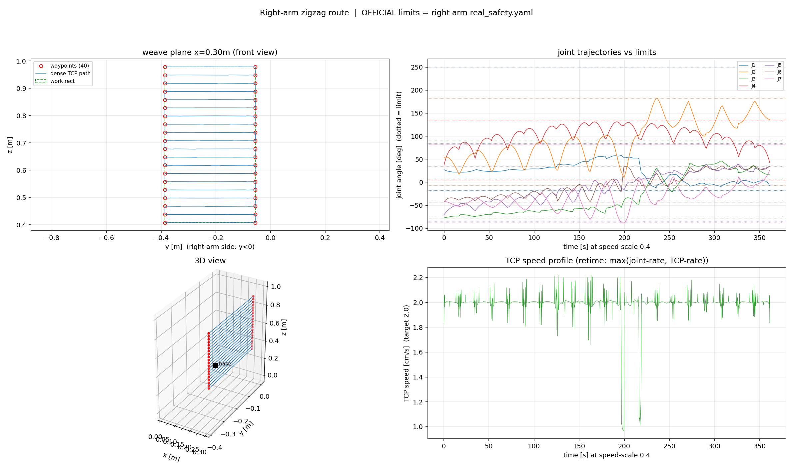

# OpenArm 之字形走线实验平台

**简体中文** | [English](README.en.md)

OpenArm v1 七自由度机械臂（达妙 DM 系列电机 + CAN-FD 总线）的
**零点标定 → 仿真 → 真机** 全链路实验工程。

主线任务：让机械臂夹爪在基座正前方 **x = 0.30 m** 的竖直平面上、按
**29 × 53 cm 长方形、3 cm 行距、36 个路点** 走之字形（zigzag）扫线，并把
这条轨迹从 MoveIt2 仿真一路部署到真机，同时解决"**跑得快**"与"**跑得稳**"
两个问题。



> 上图由 `仿真/moveit_sim/make_dense_zigzag_right.py` 生成
> （归档在 `assets/figures/moveit_zigzag_right_route.png`）。

## 已达成（截至 2026-09-23）

| 里程碑 | 结果 | 日期 |
|---|---|---|
| MoveIt2 真机首次全程走线 | speed-scale 0.4，TCP ≈ 2 cm/s，TCP 偏差 mean **1.3 mm** | 2026-09-07 |
| 双臂重构（左/右臂配置彻底隔离） | `real/{common,left,right}` | 2026-09-08 |
| RL 策略真机 60 s 分段验收 | 跟踪误差 mean **1.16°** / max 3.46°，振动窗口 3.8° → 0.7° | 2026-09-18 |
| RL 全程首跑 | 跑到 **73.4 s** 出现 0.5–2 Hz 低频摆动，操作员急停 | 2026-09-21 |
| ILC 前馈修正表上线 | 驱动积分器峰值降 **2–5×**，0.5–2 Hz 峰峰 max 1.18°（< 1.5° 判据） | 2026-09-22/23 |
| **RL + ILC 全程验收通过** | **143.6 s** 走完，零急停、终点收敛 home，跟踪 mean 1.19° / max 3.53°，双跑重复性 RMS **0.04°** | 2026-09-23 |

全程时长从 MPC 基线约 300 s 压到 **143.6 s**，同时把 0.5–2 Hz 低频摆动压到判据以内
——这是本项目当前的主线成果。

## ⚠️ 安全铁律

本仓库包含**直接驱动真实机械臂**的代码。使用前必读：

1. **协作者 / AI 不执行任何让机器人运动的命令**——只写代码、配置、给指令，
   由操作员本人执行并回传现象。
2. **标定节点与 control / MoveIt 绝不能同时运行**（两者都直接驱动电机，
   同总线会互相打架）。
3. 每次上电先跑 `can_up.sh` 配置 CAN 接口。
4. 三级急停降级：停流（Ctrl+C）→ `/safety/estop` → **物理断电**。
5. 首次上机必须**分段验证**，不要一上来跑全程。

详见 [`docs/架构文档.md`](docs/架构文档.md) §12。

## 仓库结构：哪个是哪个

顶层目录用中文命名（项目文档、脚本、运行手册全部是中文母语环境）。
下表给出英文对照与职责：

| 目录 | English | 是什么 |
|---|---|---|
| `标定/` | `calibration/` | **零点标定工具**（ROS2 包，v2 官方零位流程）。原理与官方 `openarm_can-zero-position-calibration` 一致：逐关节低速碰机械限位、记录双向限位、写入 `zero` 文件。含 vcan0 纯软件仿真验证，无硬件也能跑通全流程。 |
| `仿真/` | `sim/` | **四条仿真路线**：`moveit_sim/`（MoveIt2 主线，`dense_zigzag*.json` 产自这里）、`openarm_sim/`（RViz 纯运动学 + FK/IK 中间件）、`mujoco_sim/`（MuJoCo 对照 + RL 验证）、`isaaclab_sim/`（Isaac Lab 训练线）。 |
| `real/` | `real/` | **真机主线**。`common/` 双臂共用（ZeroOffsetHW 驱动工作区、配置生成器、100 Hz 黑匣子）；`left/`、`right/` 每臂各自的配置、MPC 执行轨、RL 执行节点。 |
| `docs/` | `docs/` | 技术文档：架构、PD 整定、RL 训练结构、MPC 插件设计、ILC 可行性、方案对比与切换协议。 |
| `ilc_sim/` | `ilc_sim/` | **ILC 离线仿真验证**（纯 numpy/scipy，消费真实轨迹文件），配套 ILC 文档。 |
| `assets/figures/` | `assets/figures/` | **全部图件集中归档**（本仓库的图不散落在代码旁边）。来源见下文〈图件与数据溯源〉。 |
| `archive/` | `archive/` | **已废弃的历史路线**（DM-USB 私有协议 + motorbridge）。⚠️ **不要在真机上使用本目录的任何脚本**。 |

**"在哪个目录下跑的工具，就是哪只臂的"**——`real/left/` 与 `real/right/` 里的关节名、
控制器名、MPC 话题都已写死对应侧，防串臂。两臂的电机都用出厂默认 CAN ID，
**同一个 CAN 口同一时刻只能接一只臂**。

## 三条执行路线（互斥）

同一个任务、同一份参考轨迹，尝试了三条执行路线。三者**完全分离、互斥运行**，
切换协议与选型判据见 [`docs/RL与MPC方案对比与切换.md`](docs/RL与MPC方案对比与切换.md)。

| 路线 | 注入方式 | 状态 |
|---|---|---|
| **① JTC / MoveIt2 基线** | `FollowJointTrajectory` action（标准 ros2_control 槽位） | 首次跑通全程，speed-scale 0.4、TCP ≈ 2 cm/s |
| **② MPC 执行轨** | `OpenArmMpcController` 控制器插件接管 JTC 槽位 | 已完成全程走线；一行可回滚 |
| **③ RL 执行轨**（当前主角） | `rl_exec.py` 独立话题注入（不经过控制器插件） | 真机全程 **143.6 s** 验收通过 |

外加一层 **ILC 前馈修正**叠在 RL 之上：不是新控制器，而是从真机运行数据离线重构
"驱动欠账力矩"，生成前馈表补偿未建模负载（线缆拖拽），压掉 0.5–2 Hz 低频摆动。

```
                ┌── ② MPC 插件 ────────┐
参考轨迹 ────────┤                      ├──→ ZeroOffsetHW ──→ 达妙电机 (CAN-FD)
dense_zigzag_   ├── ③ RL 策略 (npz) ───┤      (真机驱动)
right.json      │      + ILC 前馈表 ───┘
                └── ① JTC / MoveIt2 ───┘
```

## 数据流：谁生产、谁消费

理解这个仓库最快的路径，是顺着产物链条走一遍：

```
标定/zero, zero_right            标定产物（零位 + 实测软限位）
        │
        └─→ real/common/gen_real_config.py
                └─→ real/<side>/config/{real_safety.yaml, *_real.urdf}

仿真/isaaclab_sim/stage3_workspace.py       工作空间扫描（1 cm 网格 + 假洞修复）
        └─→ workspace.json / workspace_right.json（36 路点 + 网格关节解）
                └─→ 仿真/moveit_sim/make_dense_zigzag{,_right}.py
                        └─→ dense_zigzag{,_right}.json（稠密关节轨迹）

dense_zigzag_right.json
        ├─→ 仿真/isaaclab_sim/rl/zigzag_ref.py
        │       └─→ ref_right.npz（50 Hz 参考：q_ref/qd_ref/相位/元数据）
        │               ├─→ ② MPC：mpc_exec.py --ref
        │               ├─→ ③ RL ：rl_exec.py（策略 + 参考 + 前馈）
        │               └─→ MuJoCo 验证：mujoco_sim/rl_validate.py
        └─→ ilc_sim/ilc_sim.py（ILC 离线可行性验证）

/joint_states ──→ real/common/js_blackbox.py（100 Hz CSV，抖动归因 / ILC 误差信号）
```

**关键契约**：`real/<side>/config/d_prev_sidecar.json` 是配置生成器的幂等记录，
**删除会导致零位偏移 d 翻倍，勿删**。

## 图件与数据溯源

所有图件归档在 `assets/figures/`。每张图的来历：

| 图件 | 内容 | 怎么来的 |
|---|---|---|
| [`moveit_zigzag_right_route.png`](assets/figures/moveit_zigzag_right_route.png) | 右臂之字形路线 4 联图：工作矩形 + 路点、关节轨迹、TCP 速度剖面 | `仿真/moveit_sim/make_dense_zigzag_right.py`（2026-09-11 生成） |
| [`workspace_left.svg`](assets/figures/workspace_left.svg) | 左臂可达域 + 同支执行域 + 最大内接长方形 + 之字形 | `仿真/isaaclab_sim/stage3_workspace.py`（默认 `--side left`） |
| [`workspace_right.svg`](assets/figures/workspace_right.svg) | 同上，右臂（限位取自右臂实测 `real_safety.yaml`） | `仿真/isaaclab_sim/stage3_workspace.py --side right` |
| [`workspace_compare_20260908_old_vs_new.png`](assets/figures/workspace_compare_20260908_old_vs_new.png) | 工作矩形 17×51 cm → **29×53 cm** 前后对比 | 作者手工对比图（2026-09-08，"假洞修复"收尾时所作），无入库生成脚本 |
| [`workspace_scan_20260907_before_fix.png`](assets/figures/workspace_scan_20260907_before_fix.png) | 假洞修复过程中的中间态（19×45 cm） | 同上（2026-09-07 中间态；中文标签因缺 CJK 字体显示为方框，故被 09-08 版取代） |
| [`ref_right_profile.png`](assets/figures/ref_right_profile.png) | RL 参考轨迹剖面：关节角/速度/加速度 + TCP 速率与速度层级 | `仿真/isaaclab_sim/rl/zigzag_ref.py`（2026-09-14 生成） |
| [`real_run_report.png`](assets/figures/real_run_report.png) | 真机运行报告：按相位的 J2 跟踪误差、速度抖动 | `real/right/rl_track/analyze_real_run.py <rl_exec.csv> <blackbox.csv>`（2026-09-15 运行） |
| [`ilc_learn_curves.png`](assets/figures/ilc_learn_curves.png) | ILC 学习曲线与 Δτ 修正量（迭代 1） | `real/right/rl_track/ilc_learn.py`（2026-09-23 生成） |
| [`ilc_sim_curves.png`](assets/figures/ilc_sim_curves.png) | ILC 离线仿真收敛曲线（实验 A/B/C：有/无 Q 滤波、大增益发散对照） | `ilc_sim/ilc_sim.py`（配套 [`docs/ILC可行性_实施路径文档.md`](docs/ILC可行性_实施路径文档.md) 第 7 章） |

**入库的数据产物**同样有明确出处：`ref_right.npz`（`zigzag_ref.py`）、
`actor_right.npz`（`export_actor.py` 从训练 checkpoint 导出）、
`grav_ff_right*.npz`（`仿真/mujoco_sim/make_grav_ff.py`；ILC 迭代表由 `ilc_learn.py` 合成）、
`rl_exec_*.csv`（`rl_exec.py --log-csv` 每次真机运行的指令侧记录）。

## 快速上手

### 1) 标定（无硬件可先跑 vcan0 仿真）

```bash
cd 标定
./openarm_calibration/build.sh                          # 编译（conda 用户无需退环境）
./openarm_calibration/run_simulation.sh true left      # vcan0 + 8 电机仿真器全流程
# 实机标定：先插拔适配器后 ./openarm_calibration/scripts/can_up.sh，再 run_calibration.sh
# 重新标定后必须重跑 real/common/gen_real_config.py 重新生成真机配置
```

### 2) 仿真走线（MoveIt2 主线）

```bash
cd 仿真/moveit_sim
./start_zigzag_sim.sh          # 左臂（右臂用 start_zigzag_sim_right.sh）
# 另开终端执行之字形：
./run_moveit_zigzag.sh         # 或按 README 手动跑 zigzag_moveit.py
```

### 3) 真机部署（MPC 执行轨，右臂）

```bash
# 0) can_up.sh → 1) source 官方工作区与本工作区
cd real/right/mpc_track
/usr/bin/python3 mpc_exec.py \
    --ref ../../../仿真/moveit_sim/dense_zigzag_right.json --speed-scale 0.4
# 完整上电/启动流程见 real/right/mpc_track/README.md 末尾命令块
```

### 4) RL 路线（右臂，当前主线）

```bash
conda activate isaaclab
cd 仿真/isaaclab_sim/rl
python zigzag_ref.py                     # 生成参考轨迹（速度层级 + 平滑，≈157 s）
python train.py --headless --num_envs 2048 --max_iterations 2000
python play.py --checkpoint logs/rsl_rl/openarm_zigzag/<run>/model_final.pt

# MuJoCo 验证（同一份 actor npz + 同一份参考）
conda activate mujoco
cd 仿真/mujoco_sim && python rl_validate.py --actor ../isaaclab_sim/rl/logs/.../actor_final.npz

# 真机部署（操作员执行，分段验证；见 real/right/rl_track/README.md）
cd real/right/rl_track && /usr/bin/python3 rl_exec.py --max-t 15 --log-csv
```

### 5) ILC 离线仿真

```bash
cd ilc_sim && /usr/bin/python3 ilc_sim.py
# 输出 ilc_sim_results.json + assets/figures/ilc_sim_curves.png
```

## 环境依赖

- Ubuntu 24.04 + **ROS2 Jazzy**（`/opt/ros/jazzy`）
- 官方工作区 `openarm_ros2_ws`（提供 `openarm_can` C++ 库、`openarm_description`、
  `openarm_bimanual_moveit_config`，使用前需 source）
- CAN 适配器：**gs_usb 类**（如 candleLight，USB ID `1d50:606f`），CAN-FD 1M/5M。
  达妙私有 USB 适配器（DM-USB2FDCAN 等）**不适用**，不会生成 `can0` 接口。
- 仿真：MuJoCo（conda 环境）、Isaac Lab / Isaac Sim（conda 环境，训练需 RTX 显卡）
- ILC 离线仿真：numpy / scipy / matplotlib
- colcon 统一用系统 Python：`--cmake-args -DPython3_EXECUTABLE=/usr/bin/python3`
  （防 conda 劫持；mujoco / isaaclab 例外，走各自的 conda 环境）

**硬件**：OpenArm v1 单臂 7 自由度 + 夹爪。以左臂为例，ESC 序号 → 关节：
ESC1/2 = DM8009（肩）、ESC3/4 = DM4340（肩滚转 / 肘）、ESC5/6/7 = DM4310（腕）、
ESC8 = DM4310（夹爪，使能后原地锁定、不参与跟踪）。

## 文档索引

| 文档 | 内容 |
|---|---|
| [real/交接_20260922_ILC就绪与复验指引.md](real/交接_20260922_ILC就绪与复验指引.md) | **当前最高权威交接**：ILC 前馈表就绪、0923 全程验收判读、下一步 |
| [real/交接_20260921_RL全程验收进行时.md](real/交接_20260921_RL全程验收进行时.md) | 9-21 全程中断根因（0.5–2 Hz 猎振）、防事故清单、上机 runbook |
| [docs/架构文档.md](docs/架构文档.md) | **分层架构**（硬件 / 驱动 / 中间 / 应用）、运行时接口、参数快照、安全纪律 |
| [docs/RL训练结构详解.md](docs/RL训练结构详解.md) | RL 结构完整快照：观测 / 动作 / 控制律 / 奖励逐项公式 + 部署映射。**改训练策略前必读** |
| [docs/PD参数整定流程.md](docs/PD参数整定流程.md) | PD 整定流程 + 训练前离线筛选 + 权威孪生 + 版本沿革 + 训练事故复盘 |
| [docs/RL与MPC方案对比与切换.md](docs/RL与MPC方案对比与切换.md) | 两方案对比、配置层强隔离与切换协议 |
| [docs/MPC控制器插件_线路一改造设计.md](docs/MPC控制器插件_线路一改造设计.md) | MPC 插件化接管 JTC 槽位：模型 / 目标 / 约束规格、构建验收、一行回滚 |
| [docs/ILC可行性_实施路径文档.md](docs/ILC可行性_实施路径文档.md) | ILC 前馈层设计、整定、分阶段落地（英文版见 [`archive/ILC_feasibility_implementation_plan_en.md`](archive/ILC_feasibility_implementation_plan_en.md)） |
| [docs/RL轨迹提速_奖励与时间设计.md](docs/RL轨迹提速_奖励与时间设计.md) | 奖励设计历程、速度层级与时间分配、踩坑记录（**数值以结构详解为准**） |
| [docs/仓库整理记录.md](docs/仓库整理记录.md) | 历次结构整理变更日志（删了什么、移到哪里、体积变化） |
| [仿真/PLAN.md](仿真/PLAN.md) | 仿真总体规划与阶段划分 |
| [仿真/moveit_sim/README.md](仿真/moveit_sim/README.md) | MoveIt2 路线使用与实现详解（含 §4.7 TOTG 加速度限位补丁） |
| [仿真/isaaclab_sim/rl/README.md](仿真/isaaclab_sim/rl/README.md) | RL 训练链路用法 + 稳定性修正清单 + 踩过的坑 |
| [仿真/isaaclab_sim/rl/logs/rsl_rl/openarm_zigzag/VERSIONS.md](仿真/isaaclab_sim/rl/logs/rsl_rl/openarm_zigzag/VERSIONS.md) | **训练版本索引**：v1（600 迭代基准）/ v2（反粘滑）/ v3（课程化，当前部署） |
| [real/right/rl_track/README.md](real/right/rl_track/README.md) | RL 真机执行节点：部署检查清单、分段验证、异常处置、重力前馈通道 |
| [real/right/BRINGUP_右臂.md](real/right/BRINGUP_右臂.md) | 右臂上电 / CAN / 标定 / 调试手册（阶段 A–G） |
| [real/common/README.md](real/common/README.md) | 双臂共用层：驱动工作区、配置生成器、换臂规则 |
| [标定/README.md](标定/README.md) | 零点标定工具与 v2 官方零位流程 |
| [archive/README.md](archive/README.md) | 已废弃的 motorbridge 历史路线说明 |

## 仓库约定

仓库只入库**源码、配置、文档与少量产物**（标定结果、部署用 `*.npz`、图件、
每次真机运行的 `rl_exec_*.csv`）；colcon 构建产物、真机原始日志、
Isaac Sim 的 USD 几何资产、训练中间检查点不入库——它们都能由仓库内的
源码重建。

**完整排除清单、每一条的理由与重建命令见 [`.gitignore`](.gitignore)**，
那一个文件就是权威来源。

## 来源与致谢

- **机械臂本体与官方栈**：[enactic/openarm](https://github.com/enactic/openarm/)
  —— 本仓库使用的 URDF / 描述包、`openarm_can` C++ 库、MoveIt2 双臂配置均来自官方；
  零点标定流程 1:1 对齐官方 `openarm_can-zero-position-calibration`。
- **本项目代码**：`标定/`、`仿真/`、`real/`、`ilc_sim/`、`docs/` 为在上述官方栈
  之上的自研实验工程（含自研数值 IK、MPC 控制器插件、RL 训练与部署链、
  ILC 前馈修正层）。
- **文档性质**：`docs/` 与各处交接文档是**带日期的工程过程记录**，包含失败尝试、
  踩坑复盘与参数沿革，不是最终规范。权威状态以日期最新者为准
  （当前为 `real/交接_20260922_ILC就绪与复验指引.md`）。

## License

MIT，见 [LICENSE](LICENSE)。

> 本仓库包含直接驱动真实机械臂的代码，按 MIT "AS IS" 提供、**不附带任何担保**。
> 使用者需自行确保硬件与人员安全。
